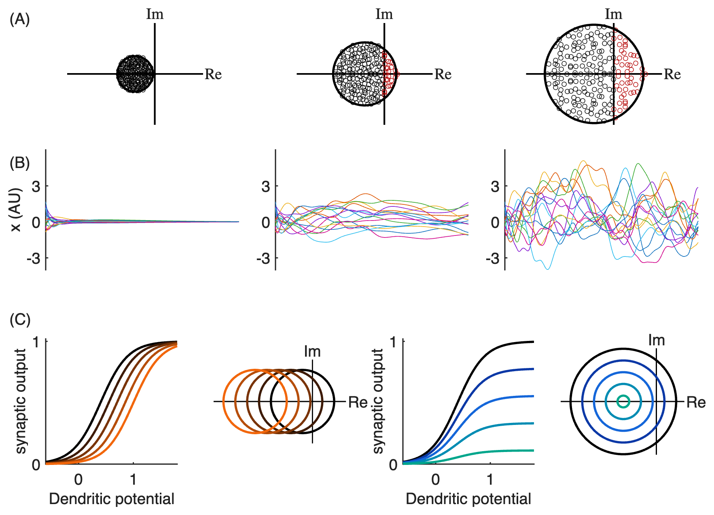
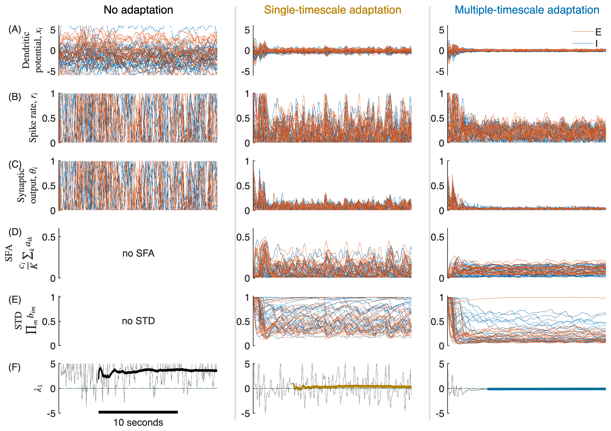
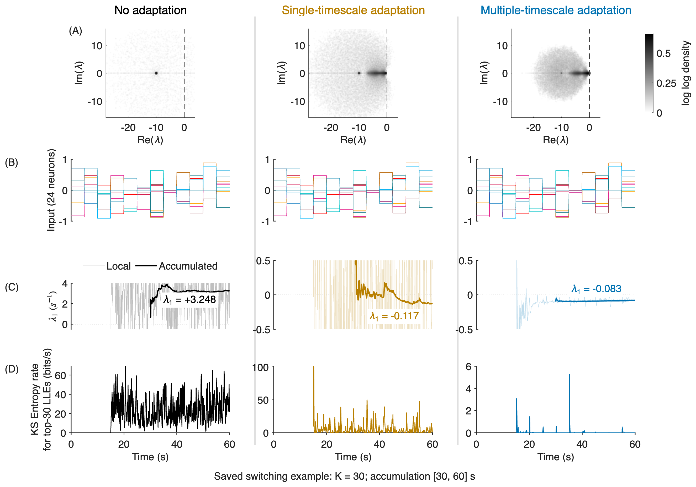
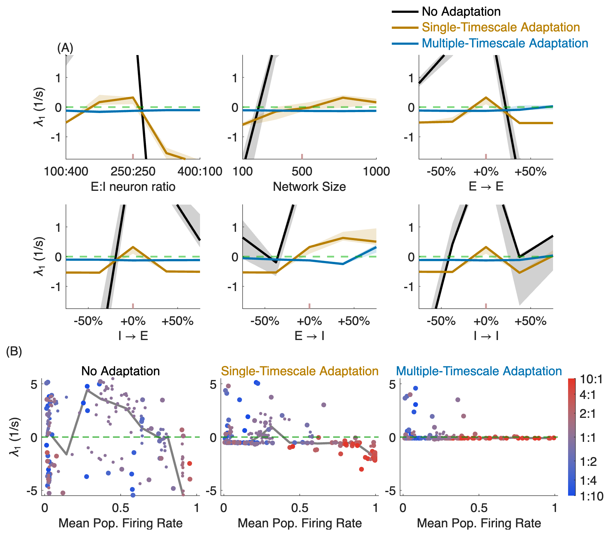
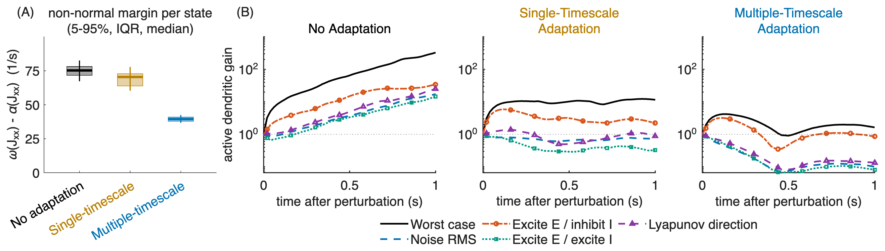
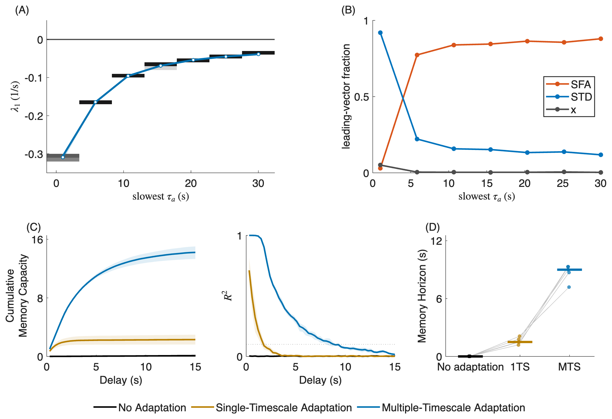
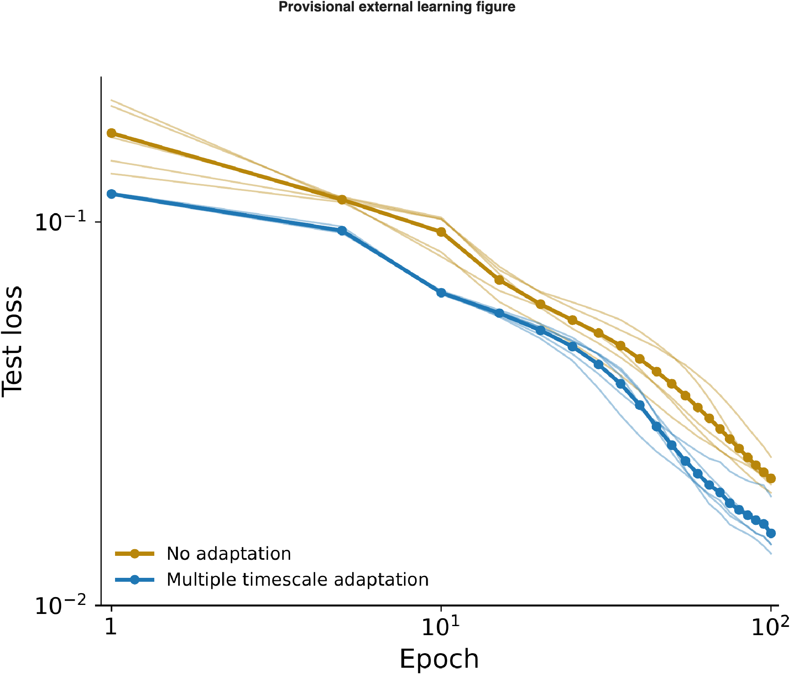
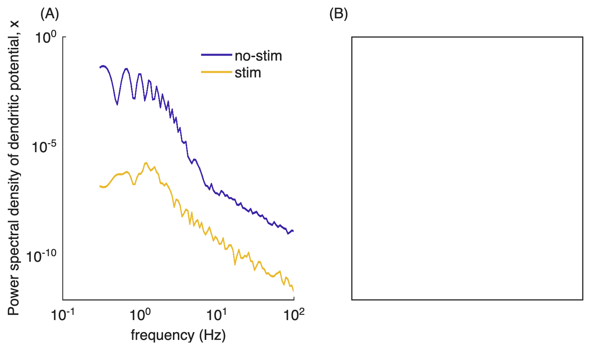

# Figure report

_Generated 15-Sep-2026 20:44:56 on Thomass-MacBook-Air.local, MATLAB 26.1.0.3203278 (R2026a)._

| | |
|---|---|
| Figure root | `/Users/tom/Desktop/local_code/FractionalReservoir/figs/sfaEI_mu7_fast_grouped` |
| Sections | 8 |
| Images | 8 |
| commit_short | `6e5bafc` |
| branch | `main` |
| dirty | `true` |
| Run directory | `/Users/tom/Desktop/local_code/FractionalReservoir/data/sfaEI_mu7_fast` |
| Preset | `celltype_pairs_sfaEI_Sc0p2sig0p1_tauSpread0p25_noStim_noise0p025_dualStd_3cond_mu7` |
| Run mode | `fast` |
| Result | 8/8 succeeded, 8/8 in-paper |
| Elapsed | 1.1 min |

_Values above are echoed from [manifest.md](manifest.md), which is the record of the run._

## Contents

- [fig_main1_grouped](#fig_main1_grouped) — 1 image, 1 table
- [fig_main2_grouped](#fig_main2_grouped) — 1 image, 1 table
- [fig_main3_grouped](#fig_main3_grouped) — 1 image, 1 table
- [fig_main4_grouped](#fig_main4_grouped) — 1 image, 1 table
- [fig_main5_grouped](#fig_main5_grouped) — 1 image, 1 table
- [fig_main6_grouped](#fig_main6_grouped) — 1 image, 1 table
- [fig_main7_grouped](#fig_main7_grouped) — 1 image, 1 table
- [fig_main8_grouped](#fig_main8_grouped) — 1 image, 1 table

## fig_main1_grouped

`fig_main1_grouped/Fig_Main1_Grouped.png`

_Inlined from [`fig_main1_grouped/Fig_Main1_Grouped_provenance.md`](fig_main1_grouped/Fig_Main1_Grouped_provenance.md)._

### Main group 1

Run: `/Users/tom/Desktop/local_code/FractionalReservoir/data/sfaEI_mu7_fast`

- Source: `/Users/tom/Desktop/local_code/FractionalReservoir/figs/sfaEI_fast/fig_introductory_concepts/eigenspectra/panelA_eigenspectrum.fig`
- Source: `/Users/tom/Desktop/local_code/FractionalReservoir/figs/sfaEI_fast/fig_introductory_concepts/statetraces/panelA_bottom_traces.fig`

For the current mu7 figure-only configuration, the native introductory source is explicitly figs/sfaEI_fast/fig_introductory_concepts (clean source commit4406b56). It uses the same sompolinsky_pairs preset, gammas[0.9,1.6,2.5], seed0, 15 traces and [0,60]s as the mu7 intro. The intervening fig_introductory_concepts code change only combined the two rows; simulation code is unchanged.

STD endpoint: tau_rec=[2 4] s, tau_rel=[0.25 0.5] s, raw reference rate r_ref=0.25. Each b_m,ss=1/(1+r_ref*tau_rec,m/tau_rel,m)=[0.333333333333333 0.333333333333333]; total product B_min=0.111111111. Five displayed frozen total factors=[1 0.777777777777778 0.555555555555556 0.333333333333333 0.111111111111111]. Intermediate factors are illustrative, not simulated steady-state points.

The sigmoid panels are conceptual logistic curves (center0.4; enlarged total SFA shift0.6), not fits to the reference piecewise activation. STD uses a frozen product B multiplying the entire curve, not the self-consistent rate-dependent steady-state input-output relation. The two-timescale product must not be identified with a single depression variable.

Each SFA curve and shifted disk shares the exact black-to-orange color; each STD curve and shrinking disk shares the exact black-through-dark-blue-to-teal color. Disk shifts/radii are effective-connectivity intuition, not exact transformations of the full active Jacobian.

Top panels are copied native saved graphics; all scientific XData/YData, neuron selections and gains are unchanged. The10-unit scale bar and its text are omitted because the example time is arbitrary up to rescaling. Only position, row labels, 14-point fonts and trace y-axis width1.0 are changed. No simulation or Lyapunov calculation is run.

Final compact-canvas update (fb6a3fb): Fixed canvas910×665 (70% of1300×950 creation baseline), fonts14 unchanged; scientific native traces and paired analytic curves retained.

## fig_main2_grouped

`fig_main2_grouped/Fig_Main2_Grouped.png`

_Inlined from [`fig_main2_grouped/Fig_Main2_Grouped_provenance.md`](fig_main2_grouped/Fig_Main2_Grouped_provenance.md)._

### Main group 2

Run: `/Users/tom/Desktop/local_code/FractionalReservoir/data/sfaEI_mu7_fast`

- Source: `/Users/tom/Desktop/local_code/FractionalReservoir/figs/sfaEI_mu7_fast/fig_example_timeseries/fig_example_timeseries.png`

Current mu7 source has no native FIG or saved x/SFA/STD trajectories. Data traces remain raster artwork, calibrated to the original axes; labels/axes/legend/dividers are native. No data values are digitized, interpolated into new estimates, or borrowed from another stage.

Original E/I neuron shades are retained. Exact individual-neuron recoloring cannot be recovered from flattened antialiased overlaps. Future numeric plots use a wider lightness/hue spread within reddish E and bluish I palettes.

Old first-row neutral text pixels and colored legend strokes are masked. Only pixels overwritten by source legend glyphs/strokes are missing; underlying trajectories cannot be recovered there. Finite LLE still begins at 5 s; the current archive has no midpoint input step. Fixed requested y limits clip outside-range source artwork.

Calibration (pixels): x origins[297,2897,5496], widths[2214,2214,2214] for[0,20] s; row bounds[101,898],[1105,1902],[2108,2906],[3112,3909],[4115,4912],[5119,5916]. x row maps[-10,10]; rate/synaptic/SFA rows[0,1]; depression[0,1.02]. LLE tick calibration: pixel5690.5=0,34.6 pixels per inverse second. Raster-coordinate precision is about one source pixel.

Numeric rendering selects half the saved neurons per type (4 saved -> 2 displayed, indices1 and4), shared across state rows, with 0.8-point neuron/local-rate lines and 1.25-point finite-LLE lines. E colors span dark red through red/coral/rose; I colors span navy through blue/cyan/teal. Current raster retains its original neuron count, shades and stroke widths; those requests await numeric data. The green dashed 0.5-point zero reference and descriptive LaTeX labels apply to both sources.

## fig_main3_grouped

`fig_main3_grouped/Fig_Main3_Grouped.png`

_Inlined from [`fig_main3_grouped/Fig_Main3_Grouped_provenance.md`](fig_main3_grouped/Fig_Main3_Grouped_provenance.md)._

### Main group 3

Run: `/Users/tom/Desktop/local_code/FractionalReservoir/data/sfaEI_mu7_fast`

- Source: `/Users/tom/Desktop/local_code/FractionalReservoir/data/sfaEI_mu7_fast/eig_heatmap/eig_heatmap_data.mat`
- Source: `/Users/tom/Desktop/local_code/FractionalReservoir/data/sfaEI_mu7_fast/local_lyapunov/local_lyapunov_data.mat`

Current switching data: K=30; accumulation [30,60] s; saved segment-start timestamps retained. No early estimates fabricated. Requested K=50 and accumulation [1,40] s are prepared in mu7revised but not run.

Input shows 24 fixed actual neurons (12 evenly spaced E and 12 I), identical indices across conditions. Row C displays saved local leading rates (thin/light) and accumulated rates (prominent); fixed requested y limits clip local excursions. The row-D KS label denotes the finite-K local positive sum = sum(max(saved local QR rates,0),2)/log(2). This is a provisional local h_KS proxy, not established invariant KS entropy; broader review deferred. Eigenvalue and switching stages are separate examples.

## fig_main4_grouped

`fig_main4_grouped/Fig_Main4_Grouped.png`

_Inlined from [`fig_main4_grouped/Fig_Main4_Grouped_provenance.md`](fig_main4_grouped/Fig_Main4_Grouped_provenance.md)._

### Main group 4

Run: `/Users/tom/Desktop/local_code/FractionalReservoir/data/sfaEI_mu7_fast`

- Source: `/Users/tom/Desktop/local_code/FractionalReservoir/data/sfaEI_mu7_fast`

Medians and IQR are unchanged. Fixed sensitivity LLE display limits clip more negative/positive values; full distributions remain supplementary.

Presentation revision: existing native grouped FIG restyled with `style_main4_grouped`; no analysis, network rebuilding, or bootstrap recomputation. Fonts are 14 pt, sensitivity ticks are -1/0/1, the shared legend is vertical at upper right, rate-bin medians are RGB [0.5 0.5 0.5] at linewidth 2.5, condition titles use the standard palette, and the ratio colorbar has no box. Native YData were verified unchanged.

Presentation follow-up: Block label(A) spans upper two sensitivity rows; label(B) identifies bottom rate row. Fonts14; saved scientific data unchanged.

Final compact-canvas update (fb6a3fb): Fixed canvas910×808 (70% width/85% height of1300×950 creation baseline, pixel-rounded);14-point fonts and axes linewidth1. A immediately above first sensitivity subplot; legend text condition-colored; B x ticks0,0.5,1 and full single-line condition titles. Styling leaves all scientific values/limits unchanged.

## fig_main5_grouped

`fig_main5_grouped/Fig_Main5_Grouped.png`

_Inlined from [`fig_main5_grouped/Fig_Main5_Grouped_provenance.md`](fig_main5_grouped/Fig_Main5_Grouped_provenance.md)._

### Main group 5

Run: `/Users/tom/Desktop/local_code/FractionalReservoir/data/sfaEI_mu7_fast`

- Source: `/Users/tom/Desktop/local_code/FractionalReservoir/data/sfaEI_mu7_fast/eig_heatmap/eig_heatmap_data.mat`
- Source: `/Users/tom/Desktop/local_code/FractionalReservoir/data/sfaEI_mu7_fast/transient_gain/transient_gain_data.mat`

Active propagator only, all five directions, regular-state medians. Actual saved horizon 1 s; no extrapolation. Margin and gain stages do not sample matched states.

Presentation revision: one row of four native panels; non-normal margin first, followed by the three active-gain conditions. All fonts 14 pt; axes linewidth 1.0. Condition labels and titles use manuscript condition colors. Margin display limits [0, 100] (assumed upper bound), ticks 0, 25, 50, 75. All saved XData/YData and five direction styles are unchanged; gain panels retain identical logarithmic limits and the saved 1 s horizon.

Presentation follow-up: Label(A) marks margin panel; label(B) marks first gain panel for the three-panel gain block. Shared legend centered under subplot3 and placed just below its xlabel. Saved curves and1 s horizon unchanged.

Final compact-canvas update (fb6a3fb): Fixed canvas1295×406 (70% of1850×580 creation baseline), fonts14 unchanged. Exported PNG2635×750 versus prior3695×973: tight bounding box includes labels/padding, so PNG ratio differs from canvas ratio. A/B labels, all5 gain curves, shared limits,1-second source horizon and legend centered below subplot3 retained.

## fig_main6_grouped

`fig_main6_grouped/Fig_Main6_Grouped.png`

_Inlined from [`fig_main6_grouped/Fig_Main6_Grouped_provenance.md`](fig_main6_grouped/Fig_Main6_Grouped_provenance.md)._

### Main group 6

Run: `/Users/tom/Desktop/local_code/FractionalReservoir/data/sfaEI_mu7_fast`

- Source: `/Users/tom/Desktop/local_code/FractionalReservoir/data/sfaEI_mu7_fast`

Slowest-timescale axes are both linear. LLE distribution display clipping and MC trial/statistics remain those of the source run.

Figure 6 presentation refresh: 14-point fonts and axes linewidth 1.0; (A) timescale LLE, (B) leading-vector fractions, (C) cumulative memory capacity plus reconstruction, (D) memory horizon. All five scientific axes, plotted X/Y data and original axis limits are unchanged. B-D have sparse y ticks; A/B x labels omit (E and I). Restyled the saved native FIG only; no analyses or simulations were run.

Presentation follow-up: Figure dimensions reduced from1500×1050 to1100×780 pixels while retaining fonts14. Panel labels(A)–(D) use normal weight. All five scientific axes, data and limits preserved.

## fig_main7_grouped

`fig_main7_grouped/Fig_Main7_Grouped.png`

_Inlined from [`fig_main7_grouped/Fig_Main7_Grouped_provenance.md`](fig_main7_grouped/Fig_Main7_Grouped_provenance.md)._

### Main group 7

Run: `/Users/tom/Desktop/local_code/FractionalReservoir/data/sfaEI_mu7_fast`

- Source: `/Users/tom/Desktop/local_code/StochasticPlasticDynamicalSystemPaper/figs_pytorch/plot_for_Brian_seeds.png`

The intended three-condition learning experiment is deferred. Any provided old image is provisional and does not demonstrate faster MTS learning.

## fig_main8_grouped

`fig_main8_grouped/Fig_Main8_Grouped.png`

_Inlined from [`fig_main8_grouped/Fig_Main8_Grouped_provenance.md`](fig_main8_grouped/Fig_Main8_Grouped_provenance.md)._

### Main group 8

Run: `/Users/tom/Desktop/local_code/FractionalReservoir/data/sfaEI_mu7_fast`

- Source: `/Users/tom/Desktop/local_code/FractionalReservoir/figs/sfaEI_mu7_fast/fig_stim_engages_adaptation/bursting_psd.png`

Model PSD retains the selected mu7 archived trace pixels. No native FIG or numerical PSD was saved for this source; other-run FIGs are not used. Data curves remain raster; axes, labels and legend are native.

Raster calibration: 3551-by-2491 PNG; x pixels 462 to 3466 map to log10 frequency -1 to 2; y pixels 64 to 2141.5 map to log10 PSD 0 to -12. Precision is about one source pixel. Native axes use log10 coordinates and exponent tick labels to preserve uniform raster spacing exactly. Neutral annotation pixels and the old legend left of the first data frequency are removed; scientific curve pixels are unchanged.

Panel B is an intentionally empty box. No patient data are shown. No titles; labels (A)/(B), 14-point fonts and axes linewidth 1.0. Fixed780-by-456 canvas is60% of the original width and height; legend is inside panel A at upper right.

> Regenerate with `write_figure_report('/Users/tom/Desktop/local_code/FractionalReservoir/figs/sfaEI_mu7_fast_grouped')`. `figs/` is gitignored; this report references the images in place rather than copying them, so it is only ever as current as its generation stamp above.
